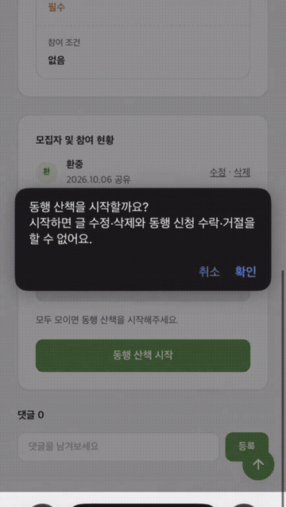
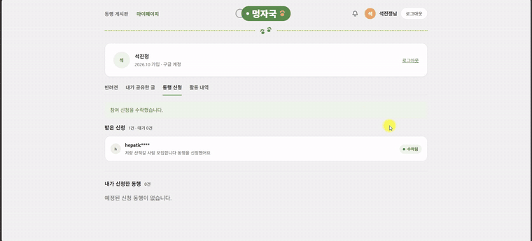

# Choi Ju Young

### Backend Developer · Java & Spring Boot

서비스의 구조와 데이터 흐름을 이해하고, 안정적인 백엔드 시스템을 만드는 개발자입니다.

 

## 👋 About Me

- **ERP 개발·유지보수 실무 경험**을 바탕으로 Java / Spring 기반의 백엔드 개발 역량을 확장하고 있습니다.
- 서비스의 **데이터 흐름과 구조를 이해하고 안정적으로 기능을 구현하는 과정**을 중요하게 생각합니다.
- Spring Boot 기반 웹 서비스와 Python 기반 **데이터 수집·처리 파이프라인**을 직접 구현했습니다.
- 백엔드 경험에 데이터 처리와 AI 기술을 결합하여 **실제 서비스 문제를 해결하는 개발자**로 성장하고 있습니다.

 

## 🛠 Tech Stack

### Backend

### Data & Database

### DevOps & Collaboration

 

# 🚀 Projects

## 🐕 멍자국
### 반려견 산책 코스 추천 및 산책 기록 웹 서비스

**4인 Team Project · 2026.09 ~ 2026.10**

반려견과의 산책을 중심으로 **산책 코스 추천, GPS 산책 기록, 동행 모집 및 커뮤니티** 기능을 하나의 사용자 흐름으로 구성한 웹 서비스입니다.

**Tech**

`Java 21` `Spring Boot` `Spring Security` `JPA` `MySQL` `Thymeleaf` `JavaScript` `Kakao Maps` `Docker`

### 🎬 Demo

#### GPS 기반 동행 산책 기록

  

실시간 GPS 위치를 기반으로 산책 경로를 지도에 표시하고 **이동 거리와 경과 시간을 기록**합니다.

#### 활동 내역 및 산책 상세 조회

  

사용자의 산책 기록을 조회하고 상세 화면에서 **산책 정보와 실제 이동 경로를 지도에서 확인**할 수 있습니다.

### Project Overview

- 현재 위치 및 조건 기반 산책 코스 추천
- GPS 기반 산책 경로·거리·시간 기록
- 반려견 프로필 및 사용자별 활동 관리
- 산책 동행 모집·신청 및 커뮤니티
- 소셜 로그인 및 사용자별 데이터 접근 제어

### My Contribution

- **마이페이지 및 반려견 프로필 관리 기능** 구현
- 사용자·반려견·산책 기록 관계를 기반으로 **활동 내역 및 산책 상세 조회** 구현
- 개인 산책은 기록 소유자, 동행 산책은 주최자와 수락된 참가자만 조회하도록 **접근 권한 검증** 구현
- 동행 모집에서 선택된 반려견 정보를 산책 시작 과정에 연동하여 **중복 선택 흐름 개선**
- 동행 신청 내역 및 수락·거절 상태 관리 기능 구현
- 공용 Entity·Repository 변경 과정에서 기존 기능과의 충돌을 조정하고 최신 데이터 구조에 맞게 통합

### Collaboration & Troubleshooting

- Feature Branch 기반 4인 Git 협업 및 PR을 통한 `dev` 브랜치 통합
- Git LFS 대용량 데이터로 인한 병합 지연 원인을 파악하고 정상 다운로드 후 충돌 해결
- 공용 Entity·Repository·Service 충돌을 최신 구조 기준으로 수동 통합하고 기능 재검증
- Docker Compose 기반 Spring Boot·MySQL·AI 서버 통합 실행 및 HTTPS 배포 환경 경험

**Repository**  
https://github.com/dydwp/meongjaguk

 

---

## 🍽️ DiningCode Dynamic Crawling Pipeline
### 동적 웹 데이터 수집·전처리·검증 및 적재 파이프라인

**Personal Project · 2026.08 ~ 2026.09**

Selenium으로 동적 웹페이지의 음식점 데이터를 제한적으로 수집하고 **Raw → Interim → Processed → MySQL** 단계로 처리하는 데이터 파이프라인을 구축한 개인 프로젝트입니다.

**Tech**

`Python` `Selenium` `BeautifulSoup` `pandas` `MySQL` `pytest` `Ruff` `GitHub Actions` `GCE`

### 🎬 Demo

  

  <b>▶ 이미지를 클릭하면 전체 데이터 파이프라인 실행 영상을 확인할 수 있습니다.</b>

### Pipeline

`Selenium → Raw HTML → Extract → Interim → Preprocess & Validation → Processed → MySQL UPSERT`

### Key Features

- Selenium 기반 동적 페이지 데이터 수집 및 상세 페이지 처리
- Raw / Interim / Processed 데이터 계층을 분리하여 수집 원본과 가공 데이터 관리
- URL 중복 제거 및 필수값·중복 데이터 검증
- MySQL PK / UNIQUE 제약을 활용한 **멱등 UPSERT**
- pytest 기반 단위 테스트 및 Ruff 정적 검사
- GitHub Actions 기반 CI 구축
- GCE 인스턴스 **자동 시작 → 데이터 수집·처리 → DB 저장·검증 → 자동 종료** 흐름 구성
- Selenium Timeout에 재시도 및 작업 단위 예외 처리를 적용하여 개별 실패가 전체 Batch 중단으로 이어지지 않도록 개선

### Result

- 수집 후보 75개에서 URL 중복 제거 후 **72개 음식점 × 16개 컬럼** 데이터 구성
- `restaurant_id`, `source_url` 중복 **0건**
- Processed CSV **72건 / MySQL DB 72건**
- 상세 HTML **72건 / 최종 수집 실패 0건**
- pytest **56개 테스트** 구성

**Repository**  
https://github.com/jy-0202/diningcode-dynamic-crawling-pipeline

 

---

## 🍴 Today Pick
### 조건 기반 맛집 탐색 및 추천 웹 서비스

**Personal Project · 2026.07 ~**

지역·카테고리·가격대·태그 등의 조건으로 음식점을 탐색하고 상세 정보와 지도 위치를 확인할 수 있도록 개발 중인 Spring Boot 기반 개인 웹 프로젝트입니다.

**Tech**

`Java 21` `Spring Boot 3.5` `JPA` `MySQL` `Thymeleaf` `JavaScript` `Kakao Maps`

### Key Features

- 지역·카테고리·가격대·태그 기반 조건 검색
- 음식점명 및 메뉴명 통합 검색
- 음식점 상세 정보·메뉴·리뷰 및 평균 평점 조회
- Kakao Maps 기반 음식점 위치 표시
- Controller - Service - Repository 계층 구조를 적용한 기능 분리
- 지도 이동 영역을 기준으로 음식점 카드와 결과 개수를 동기화하여 **지도와 검색 목록의 데이터 일관성 개선**
- 자연어 추천 기능 확장을 위한 AI 추천 화면 및 Service·DTO 기본 구조 구성

### Next

- 현재 위치 기반 주변 음식점 조회 및 거리순 정렬
- 지도 영역과 검색 조건을 결합한 탐색 기능
- 음식점·메뉴·리뷰 데이터를 활용한 추천 방식 고도화
- 자연어에서 사용자 조건을 추출하여 기존 검색 기능과 연계하는 AI 추천 기능

**Repository**  
https://github.com/jy-0202/today-pick

 

# 💼 Experience

## (주)아이씨엔아이티
**ERP 개발·유지보수 · 2015.02 ~ 2017.02**

- 고객사 ERP 및 업무·웹 시스템 개발·유지보수
- 업무 화면, Query 및 출력 기능의 오류 원인 분석과 기능 개선
- 브랜드별 출력 양식, 바코드 라벨 및 행택 개발·수정
- MSSQL 기반 운영 데이터 조회 및 기준정보 관리
- 개발 서버 반영 → 고객사 확인 → 운영 서버 적용 과정 수행
- 9개 브랜드별 ERP 출력 양식 및 가격·Lead Time 조건에 따른 출력 로직 구현

 

# 🎓 Education & Certification

### 경기대학교
**컴퓨터과학과 · 2010.03 ~ 2015.02**

### 더조은컴퓨터아카데미 종로
**자바, 파이썬 활용 빅데이터 분석과 AI SW개발자 양성과정**  
2026.03.30 ~ 2026.10.12 · 1,050시간

### Certification

**정보처리기사** · 한국산업인력공단 · 2014.05

 

---

### 📫 Contact

**GitHub** · https://github.com/jy-0202

